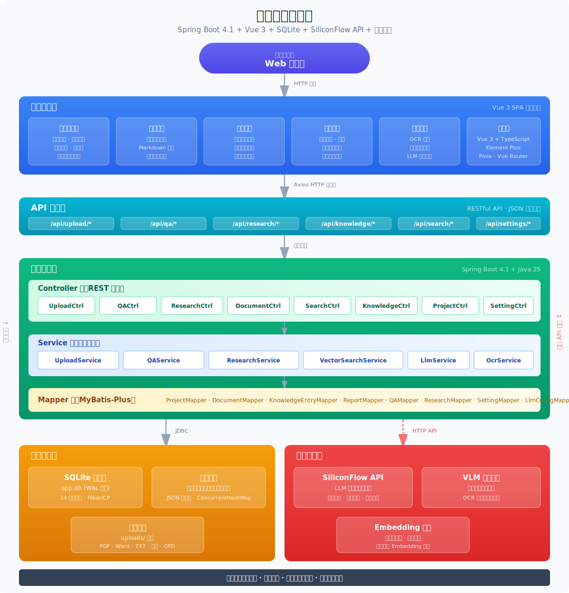

# Personal Knowledge Base
<p align="center">
  <strong>A personal knowledge base that builds itself.</strong>

  Upload documents, build knowledge graphs, and answer questions — all powered by LLMs.
</p>
<p align="center">
  <a href="#features">Features</a> •
  <a href="#what-is-this">What is this?</a> •
  <a href="#architecture">Architecture</a> •
  <a href="#tech-stack">Tech Stack</a> •
  <a href="#installation">Installation</a> •
  <a href="#credits">Credits</a> •
  <a href="#license">License</a>
</p>
<p align="center">
  English | <a href="README_CN.md">中文</a>
</p>
---
<p align="center">
  
</p>

## Features

- **Multi-format Document Upload** — PDF, Word, Excel, images (OCR), and text files with automatic parsing, classification, and incremental processing
- **Two-Step Chain-of-Thought Extraction** — LLM analyzes first, then generates structured knowledge entries with source traceability
- **Smart Q&A (Graph-RAG)** — Ask questions about your documents with citation tracking, confidence scoring, and cross-document verification
- **4-Signal Knowledge Graph** — relevance model with direct links, source overlap, Adamic-Adar, and keyword overlap
- **Louvain Community Detection** — automatic knowledge cluster discovery with cohesion scoring
- **Deep Research** — multi-step reasoning, multi-query web search, auto-synthesize findings into research reports
- **Dual-Space Architecture** — separate portal (analysis workspace) and admin (management workspace) sharing unified data
- **Project Isolation** — multi-project support with independent knowledge bases and cross-project switching
- **Local-First Security** — all data stored locally in SQLite, no external cloud dependencies
- **Vector Semantic Search** — FAISS-based embedding retrieval via SiliconFlow, supports any OpenAI-compatible endpoint

## What is this?

Personal Knowledge Base is a cross-platform desktop application that turns your documents into an organized, interlinked knowledge base — automatically. Instead of traditional RAG (retrieve-and-answer from scratch every time), the system **incrementally builds and maintains structured knowledge entries** from your sources. Knowledge is compiled once and kept current, not re-derived on every query.

This project is based on [Karpathy's LLM Wiki pattern](https://gist.github.com/karpathy/442a6bf555914893e9891c11519de94f) and inspired by [LLM Wiki](https://github.com/nashsu/llm_wiki). We implemented the core ideas as a full-stack web application with significant enhancements for enterprise-grade document management and analysis.

### Key Differences from LLM Wiki

| Aspect | LLM Wiki | Personal Knowledge Base |
|--------|----------|------------------------|
| Architecture | Desktop app (Electron) | Full-stack web app (Spring Boot + Vue 3) |
| Database | File-based wiki | SQLite + MyBatis-Plus ORM |
| Frontend | React | Vue 3 + Element Plus |
| Document types | Markdown, web pages | PDF, Word, Excel, images, text |
| Knowledge format | Wiki pages with YAML frontmatter | Structured entries with classification |
| Project model | Single wiki | Multi-project with isolation |
| Deployment | Local desktop | Web + Tauri desktop |

## Architecture

```
┌─────────────────────────────────────────────────────────┐
│                  Frontend (Vue 3 + Element Plus)         │
│  ┌──────────────┐     ┌──────────────────────────────┐  │
│  │   Portal     │     │       Admin                  │  │
│  │  (Analysis)  │     │    (Management)              │  │
│  │  Home, QA,   │     │  Dashboard, Sources, Reports │  │
│  │  DeepResearch│     │  Charts, KG, Settings...     │  │
│  └──────┬───────┘     └──────────┬───────────────────┘  │
└─────────┼────────────────────────┼──────────────────────┘
          │    REST API (HTTP)     │
┌─────────┼────────────────────────┼──────────────────────┐
│         ▼                        ▼                      │
│              Backend (Spring Boot 4.1)                  │
│  ┌─────────────┐  ┌──────────┐  ┌───────────┐  ┌────┐ │
│  │  LLM Service│  │  Vector  │  │  Document  │  │ KG │ │
│  │  (Chat/     │  │  Search  │  │  Upload    │  │Svc │ │
│  │  Embedding) │  │  (FAISS) │  │  Service   │  │    │ │
│  └──────┬──────┘  └────┬─────┘  └─────┬─────┘  └──┬─┘ │
│         │              │              │             │   │
│  ┌──────▼──────────────▼──────────────▼─────────────▼┐  │
│  │              SQLite Database (WAL Mode)           │  │
│  └──────────────────────────────────────────────────┘  │
└─────────────────────────────────────────────────────────┘
          │
          ▼
   External LLM APIs
   (DeepSeek, SiliconFlow, OpenAI, etc.)
```

## Tech Stack

| Layer | Technology |
|-------|-----------|
| Frontend | Vue 3.5 + Element Plus 2.14 + TypeScript + Vite |
| Backend | Spring Boot 4.1 + MyBatis-Plus 3.5 + Java 25 |
| Database | SQLite (WAL mode) |
| AI/LLM | OpenAI-compatible API (DeepSeek, SiliconFlow, OpenAI, Anthropic, etc.) |
| Embedding | SiliconFlow Embedding API (BGE-large-zh-v1.5) |
| Vector Search | FAISS |
| Visualization | ECharts (knowledge graph) |
| Desktop | Tauri 2 (optional) |

## Installation

### Prerequisites

- **Java 21+** and Maven 3.8+
- **Node.js 18+** and npm 9+
- LLM API key (DeepSeek, OpenAI, or other OpenAI-compatible provider)
- Embedding API key (SiliconFlow or other provider)

### 1. Clone the Repository

```bash
git clone https://github.com/setsu2420/Personal-KnowledgeBase.git
cd Personal-KnowledgeBase
```

### 2. Configure Environment Variables

```bash
cp .env.example .env
```

Edit `.env` and fill in your API keys:

```bash
# LLM Configuration
LLM_API_KEY=sk-your-llm-api-key
LLM_API_BASE_URL=https://api.deepseek.com
LLM_MODEL=deepseek-chat
LLM_PROVIDER=deepseek

# Embedding Configuration
EMBEDDING_API_KEY=sk-your-embedding-api-key
EMBEDDING_API_BASE_URL=https://api.siliconflow.cn
EMBEDDING_MODEL=BAAI/bge-large-zh-v1.5
```

### 3. Start the Backend

```bash
cd backend-springboot
./mvnw spring-boot:run
```

Backend will be available at `http://localhost:8080`.

### 4. Start the Frontend

```bash
cd frontend-vue
npm install
npm run dev
```

Frontend will be available at `http://localhost:5173`.

### 5. Access the Application

| Workspace | URL | Description |
|-----------|-----|-------------|
| Portal | http://localhost:5173/portal | Analysis workspace: Home, Smart QA, Deep Research |
| Admin | http://localhost:5173/admin | Management workspace: Dashboard, Sources, Reports, Settings |

## Configuration

### LLM Settings

You can configure LLM providers in two ways:

1. **Environment Variables** (`.env` file) — Default configuration loaded at startup
2. **Web UI** — Go to Admin → Settings → LLM Configuration to add/edit providers

Supported providers: DeepSeek, OpenAI, Anthropic, Azure OpenAI, SiliconFlow, Qwen (Tongyi), Moonshot (Kimi), Google Gemini, Ollama, and more.

### Database

The application uses SQLite with WAL mode. Database file is stored at `data/app.db`. The schema is automatically initialized on first startup.

### File Upload

Uploaded files are stored in `uploads/` directory. Maximum file size: 100MB. Supported formats: PDF, DOCX, XLSX, PNG, JPG, TXT, MD, CSV.

## Project Structure

```
Personal-KnowledgeBase/
├── frontend-vue/          # Vue 3 frontend application
│   ├── src/
│   │   ├── views/
│   │   │   ├── portal/    # Portal pages (Home, SmartQA, DeepResearch)
│   │   │   └── admin/     # Admin pages (Dashboard, Sources, Charts, Settings...)
│   │   ├── api/           # API client modules
│   │   ├── router/        # Vue Router configuration
│   │   └── store/         # Pinia state management
│   └── package.json
├── backend-springboot/    # Spring Boot backend
│   ├── src/main/java/com/intelligence/platform/
│   │   ├── controller/    # REST API controllers (20+ endpoints)
│   │   ├── service/       # Business logic
│   │   ├── mapper/        # MyBatis-Plus data access
│   │   ├── entity/        # Entity classes
│   │   └── config/        # Configuration
│   └── src/main/resources/
│       ├── application.properties
│       └── schema-v2.sql  # Database schema with seed data
├── docs/                  # Project documentation
│   ├── architecture.md    # System architecture details
│   ├── api-reference.md   # Complete REST API documentation
│   ├── frontend-pages.md  # Page descriptions and navigation
│   └── project-introduction.md  # Feature specifications
├── .env.example           # Environment variables template
└── README.md
```

## Documentation

- [Architecture Overview](docs/architecture.md) — System architecture and tech stack details
- [API Reference](docs/api-reference.md) — Complete REST API documentation (100+ endpoints)
- [Frontend Pages](docs/frontend-pages.md) — Page descriptions and navigation structure
- [Project Introduction](docs/project-introduction.md) — Detailed feature specifications

## Credits

The foundational methodology comes from **Andrej Karpathy**'s [LLM Wiki pattern](https://gist.github.com/karpathy/442a6bf555914893e9891c11519de94f), which describes the pattern of using LLMs to incrementally build and maintain a personal wiki.

Special thanks to [LLM Wiki](https://github.com/nashsu/llm_wiki) by Yong Su for the concrete desktop application implementation that inspired many of the features in this project, including the knowledge graph relevance model, community detection, and deep research workflow.

Built with [Vue 3](https://vuejs.org/), [Element Plus](https://element-plus.org/), [Spring Boot](https://spring.io/projects/spring-boot), and [ECharts](https://echarts.apache.org/).

## License

This project is licensed under the MIT License - see the [LICENSE](LICENSE) file for details.
